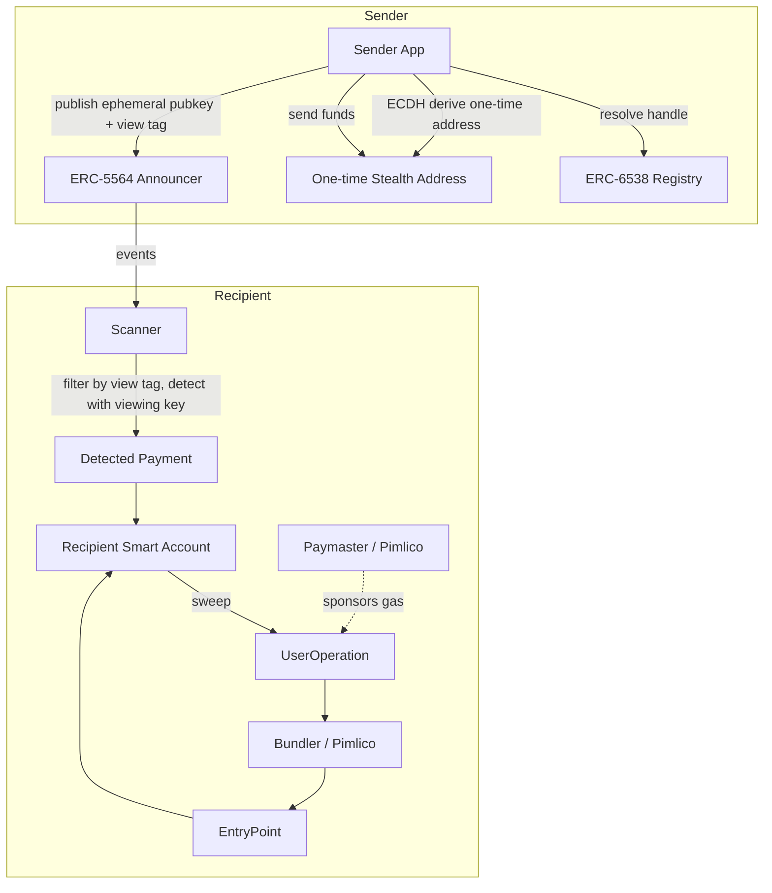

# ROAD TO DEVCON – IIITN EDITION

## StealthTag

> **Publish one payment handle. Receive every payment at a fresh, unlinkable one-time address only you control.**

### Built At
Ethereum Research Workshop & Builders Lab  
**IIIT Nagpur × Bhaisaaab**

---

## Project Overview

StealthTag lets anyone publish a **single public payment handle** (a stealth meta-address) while every payment they receive lands at a **fresh, one-time address** that only they can control.

Senders resolve the recipient's published meta-address, derive a unique stealth address using ECDH (ERC-5564), send funds there, and publish the ephemeral public key through the ERC-5564 Announcer contract. The recipient scans those announcements, detects incoming payments using their viewing key and view-tag filtering, then sweeps the funds out — **with gas sponsored by a Paymaster so that no stealth address is ever funded from a known wallet**.

---

## The Problem

A public Ethereum address is a public ledger entry. Publishing `0xYou` means:
- Everyone can see **who** paid you and **how much**
- Everyone can **total your balance** at any time
- Your **payment graph** is fully reconstructable — who paid you, when, how often

For creators, freelancers, merchants, and donees, this is a significant privacy failure.

---

## The Solution

StealthTag uses **ERC-5564 stealth addresses** to break the linkability:

1. You publish **one meta-address** (your handle)
2. Each sender derives a **fresh one-time address** from your meta-address using ECDH — a different address for every payment
3. Funds land at that one-time address, which looks like any random address on-chain
4. You detect and sweep each payment using your **viewing key** — without ever funding the stealth addresses from a known wallet

An on-chain observer cannot link multiple payments to the same recipient, cannot total the recipient's balance, and cannot reconstruct the payment graph.

---

## Why Account Abstraction?

**This is where AA does real work, not decoration.**

Sweeping funds out of a stealth address requires gas _at that address_. If you top up the stealth address with gas from your main wallet, those two addresses are linked on-chain — and the entire privacy guarantee collapses.

A **Paymaster sponsors the sweep gas**, so funds leave the stealth address via a UserOperation **without the stealth address ever being funded from a known wallet**.

```
Stealth Address → UserOperation → Bundler → EntryPoint → Smart Account execution
                                                 ↑
                                           Paymaster sponsors gas
```

ERC-4337 Account Abstraction is therefore **load-bearing**, not decorative.

---

## Key Features

- 🔑 **One handle, unlimited payments** — publish a single stealth meta-address, receive at distinct one-time addresses
- 🔍 **Efficient scanning** — ERC-5564 view tags reduce scanning work by ~256×
- 🚀 **Sponsored sweeps** — Paymaster covers gas so stealth addresses are never linked to a known wallet
- 🔗 **Unlinkability view** — demonstrates that a block explorer observer cannot connect your received payments
- 🛡️ **ERC-6538 registry** — on-chain storage of your meta-address, human-readable handle
- ⚡ **Smart account** — Kernel v3 smart account executes the sweep
- 🌐 **Demo mode** — full UI with simulated sweep when bundler/Paymaster is unavailable

---

## ERC-5564 / ERC-6538 Stealth Address Design

### Meta-address
A stealth meta-address encodes two public keys:
- **Spending public key** (`K_s`) — used to derive the one-time address
- **Viewing public key** (`K_v`) — used to detect incoming payments without spending ability

Format: `st:eth:0x<spending_pubkey><viewing_pubkey>` (ERC-5564 encoding — both keys are **compressed** 33-byte secp256k1 points)

### Key Derivation (Sender)
1. Generate ephemeral keypair `(e, E)` where `E = e·G`
2. Compute shared secret `S = e·K_s` (ECDH with recipient's spending key)
3. Hash it: `h = keccak256(abi.encode(S))`
4. One-time stealth address: `P = h·G + K_s` (the address corresponding to this point)
5. **View tag**: first byte of `keccak256(abi.encode(S))` — lets recipient cheaply pre-filter

### Detection (Recipient)
1. For each announcement, compute `S' = v·E` (ECDH with viewing key `v` and sender's ephemeral `E`)
2. Hash it: `h' = keccak256(abi.encode(S'))`
3. Check if view tag matches → if not, skip (256× cheaper scanning)
4. If view tag matches, reconstruct the address and check if it matches the announced address

### Spending (Recipient)
Stealth private key: `p = h + s` where `s` is the spending private key  
This is the private key that controls the one-time stealth address.

### Contracts (Sepolia Testnet)
| Contract | Address |
|----------|---------|
| ERC-5564 Announcer | `0x55649E01B5Df198D18D95b5cc5051630cfD45564` |
| ERC-6538 Registry  | `0x6538E6bf4B0eBd30A8Ea093027Ac2422ce5d6538` |

> Source: [ScopeLift stealth-address-erc-contracts](https://github.com/ScopeLift/stealth-address-erc-contracts)

---

## ERC-4337 / Smart Account Architecture

| Component | Role in StealthTag |
|-----------|-------------------|
| **Smart Account** (Kernel v3) | The recipient's account that executes the sweep |
| **UserOperation** | The sweep transaction, signed by the recipient's EOA |
| **Bundler** (Pimlico) | Packages the UserOperation and submits it to EntryPoint |
| **EntryPoint** | ERC-4337 singleton that validates and executes UserOps |
| **Paymaster** (Pimlico Verifying) | Sponsors the sweep gas — critical for unlinkability |

The **Paymaster is what makes stealth sweeping private**: it pays gas on behalf of the UserOperation, so the stealth address never needs to receive ETH from a known wallet.

---

## User Flow

```
RECIPIENT SETUP
1. Connect wallet (EOA)
2. Smart account created (Kernel v3)
3. Generate stealth meta-address (spending key + viewing key)
4. Register meta-address in ERC-6538 Registry
5. Share your handle / meta-address

SENDER FLOW
1. Enter recipient's handle
2. Resolve meta-address from ERC-6538 Registry
3. Derive one-time stealth address via ECDH (ERC-5564)
4. Send ETH to that one-time address
5. Publish ephemeral pubkey + view tag to ERC-5564 Announcer

RECIPIENT — SCAN + SWEEP
1. Scanner watches ERC-5564 Announcer events
2. Filter by view tag (256× speedup)
3. Detect payments using viewing key
4. Select detected payments to sweep
5. Smart account executes sweep as UserOperation
6. Paymaster sponsors gas → stealth address never linked to known wallet
```

---

## Tech Stack

| Layer | Technology |
|-------|-----------|
| Frontend | Next.js 15 (App Router), React 18, TypeScript |
| Styling | Tailwind CSS, custom dark theme |
| Wallet Connection | wagmi v2, viem v2 |
| Stealth Addresses | `@scopelift/stealth-address-sdk` |
| Smart Accounts | `permissionless` (Kernel v3 via ZeroDev) |
| Bundler / Paymaster | Pimlico |
| Chain | Ethereum Sepolia (chainId 11155111) |

---

## Project Structure

```
stealthtag/
├── app/
│   ├── layout.tsx              # Root layout with providers
│   ├── page.tsx                # Landing / home page
│   ├── setup/
│   │   └── page.tsx            # Meta-address setup & registration
│   ├── send/
│   │   └── page.tsx            # Sender: pay a handle
│   ├── scan/
│   │   └── page.tsx            # Recipient: scan + sweep
│   └── explore/
│       └── page.tsx            # Unlinkability explorer view
├── components/
│   ├── layout/                 # Header, nav, footer
│   ├── ui/                     # Reusable UI primitives
│   └── stealth/                # Stealth-specific components
├── lib/
│   ├── stealth.ts              # ERC-5564 derivation & detection
│   ├── registry.ts             # ERC-6538 registry interactions
│   ├── announcer.ts            # ERC-5564 Announcer interactions
│   ├── smartAccount.ts         # Smart account + UserOperation + Paymaster
│   ├── chain.ts                # Chain config, contract addresses
│   └── demo.ts                 # Demo mode seed data & simulation
├── hooks/
│   ├── useStealthKeys.ts       # Stealth key generation & storage
│   ├── useScanner.ts           # Announcement scanning
│   └── useSweep.ts             # Sponsored sweep logic
├── types/
│   └── index.ts                # Shared TypeScript types
├── public/                     # Static assets
├── .env.example
├── README.md
├── ARCHITECTURE.md
├── DEMO.md
└── PITCH.md
```

---

## Getting Started

```bash
git clone <repository>
cd stealthtag

npm install

cp .env.example .env.local
# Fill in your API keys in .env.local

npm run dev
```

Open [http://localhost:3000](http://localhost:3000)

---

## Environment Variables

| Variable | Required | Description |
|----------|----------|-------------|
| `NEXT_PUBLIC_RPC_URL` | Yes | Sepolia RPC URL (Alchemy/Infura) |
| `NEXT_PUBLIC_PIMLICO_API_KEY` | Yes* | Pimlico bundler+paymaster API key |
| `NEXT_PUBLIC_WALLETCONNECT_PROJECT_ID` | Yes | WalletConnect Cloud project ID |
| `NEXT_PUBLIC_CHAIN_ID` | No | Defaults to 11155111 (Sepolia) |
| `NEXT_PUBLIC_DEMO_MODE` | No | Set `true` to simulate the sweep |

*If `NEXT_PUBLIC_PIMLICO_API_KEY` is absent, the app automatically enters **Demo Mode**.

---

## Smart Contracts

### Reused (canonical ScopeLift deployments — Sepolia)
| Contract | Address | Purpose |
|----------|---------|---------|
| ERC-5564 Announcer | `0x55649E01B5Df198D18D95b5cc5051630cfD45564` | Stores ephemeral pubkey + view tag for each payment |
| ERC-6538 Registry | `0x6538E6bf4B0eBd30A8Ea093027Ac2422ce5d6538` | Maps addresses to stealth meta-addresses |

No custom contracts are deployed — we reuse the canonical standard implementations.

---

## Architecture Diagram



---

## Account Abstraction Features

| Feature | Status | Purpose |
|---------|--------|---------|
| Sponsored sweep gas | ✅ Core | Keeps stealth addresses unlinkable |
| Kernel v3 smart account | ✅ Core | Executes the sweep UserOperation |
| Batched multi-sweep | 🔜 Nice-to-have | Sweep N stealth balances in 1 UserOp |
| Passkey / social login | 🔜 Future | Gasless onboarding without EOA |

---

## Demo

See [DEMO.md](./DEMO.md) for the full 2-minute script.

**Quick summary:**
1. Show your handle (meta-address)
2. Send 3 payments from "Alice" — each lands at a distinct one-time address
3. Challenge the room: "Here's my handle, find my total balance — you can't"
4. Hit Sweep → Paymaster sponsors gas → funds collected, stealth addresses never linked

---

## Future Improvements

- **Batch sweeping** — multiple stealth addresses in one UserOperation
- **ENS integration** — map `you.eth` to your stealth meta-address
- **Private RPC relay** — prevent IP-level linkage of announcement queries
- **Passkey onboarding** — sign into your smart account without a seed phrase
- **Amount splitting** — break large amounts into multiple outputs to reduce amount correlation
- **Multi-chain** — Base Sepolia, Arbitrum Sepolia support

---

## Privacy & Correlation

StealthTag provides **unlinkability between payments**, not anonymity. The full
actor-by-actor analysis is in [`PRIVACY.md`](./PRIVACY.md). In short:

- **Stealth addresses (ERC-5564)** — unlinkability between payments.
- **Paymaster (ERC-4337)** — gas sponsorship. **Not privacy.**
- **Relay** — hides the user's IP from Pimlico and the RPC provider. **Not anonymity**; the relay operator sees what they used to.
- **EIP-7702** — makes the stealth EOA itself the ERC-4337 sender, so no migration hop is needed. A plumbing fix with no privacy content.

The stealth address never needs ETH from your known wallet: it either has its
gas sponsored, or pays from the ETH it already received. The largest remaining
risk is the **sweep destination** — sweeping to a publicly known address
re-links everything, and no amount of sponsorship prevents that.

## Security Considerations

- Private keys (spending key, viewing key) are derived with domain-separated HKDF-SHA256 from **two** required inputs: a wallet signature *and* a user passphrase that never appears in the signed message. A signature harvested by a malicious site is not enough to reconstruct them. Full model and residual risks: [`SECURITY.md`](./SECURITY.md)
- Only the **public** half of the key bundle reaches `localStorage`. The private keys are held in session memory and are gone on reload
- The viewing key is separate from the spending key — you can share it for "view-only" audit without giving spending ability
- Stealth addresses appear as random addresses on-chain; only the recipient can identify which ones belong to them
- In production: use a private RPC relay for scanning to avoid IP-level correlation of announcement queries

---

## Privacy Considerations

### What StealthTag Provides
- ✅ **Unlinkability of received payments** to the recipient's identity and to each other.
- ✅ **Balance non-disclosure** — the recipient's total balance is not exposed through a single public address.

### What StealthTag Does NOT Provide / What Remains Observable
1. **Amounts are public.** Equal or round transfer amounts enable amount-correlation between a send and a stealth address.
2. **ERC-6538 registration publicly links the user's EOA to their meta-address.** Anyone can see on-chain that EOA `0x...` registered a specific stealth meta-address. *Mitigation:* Register from an unlinked fresh address, or share the stealth meta-address off-registry (direct P2P / off-chain handle).
3. **Announcements are public events.** Their existence, frequency, total count, and precise **timing** are visible on-chain to all network observers.
4. **Network/RPC metadata (IP address).** RPC providers can correlate the recipient's IP address with specific announcement scanning queries or sweep submissions until a privacy relay is used.

> **Honesty Note:** StealthTag is a prototype demonstrating unlinkable receiving and sponsored sweeping on Ethereum. It does not provide sender anonymity, amount confidentiality, or network-level anonymity.

---

## Built During

**ROAD TO DEVCON – IIITN EDITION**  
Ethereum Research Workshop & Builders Lab  
IIIT Nagpur × Bhaisaaab
